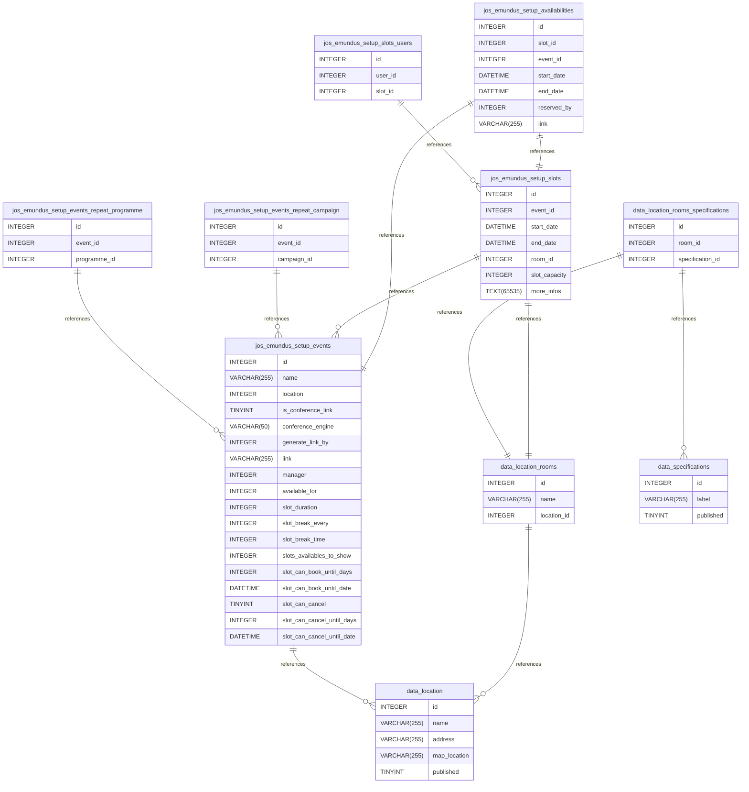

::: details Summary

- [Introduction](#introduction)
- [Database Type](#database-type)
- [Table Structure](#table-structure)
    - [jos_emundus_setup_events](#jos_emundus_setup_events)
    - [data_location](#data_location)
    - [data_location_rooms](#data_location_rooms)
    - [jos_emundus_setup_events_repeat_programme](#jos_emundus_setup_events_repeat_programme)
    - [jos_emundus_setup_events_repeat_campaign](#jos_emundus_setup_events_repeat_campaign)
    - [data_location_rooms_specifications](#data_location_rooms_specifications)
    - [data_specifications](#data_specifications)
    - [jos_emundus_setup_slots](#jos_emundus_setup_slots)
    - [jos_emundus_setup_slots_users](#jos_emundus_setup_slots_users)
    - [jos_emundus_setup_availabilities](#jos_emundus_setup_availabilities)
- [Relationships](#relationships)
- [Database Diagram](#database-Diagram)
  :::

#### Database type
- **Database system:** MySQL

#### Table structure

##### jos_emundus_setup_events

| Name        | Type          | Settings                      | References                    | Note                           |
|-------------|---------------|-------------------------------|-------------------------------|--------------------------------|
| **id** | INTEGER | 🔑 PK, not null , unique, autoincrement |  | |
| **name** | VARCHAR(255) | not null  |  | |
| **location** | INTEGER | not null  | jos_emundus_setup_events_location_fk | |
| **is_conference_link** | TINYINT | not null , default: 0 |  | |
| **conference_engine** | VARCHAR(50) | not null  |  |teams, zoom, other |
| **generate_link_by** | INTEGER | not null  |  |Par réservation, par plage de réservation |
| **link** | VARCHAR(255) | not null  |  | |
| **manager** | INTEGER | not null  |  | |
| **available_for** | INTEGER | not null  |  |campaigns, programs |
| **slot_duration** | INTEGER | not null  |  | |
| **slot_break_every** | INTEGER | not null  |  | |
| **slot_break_time** | INTEGER | not null  |  | |
| **slots_availables_to_show** | INTEGER | not null  |  | |
| **slot_can_book_until_days** | INTEGER | not null  |  | |
| **slot_can_book_until_date** | DATETIME | not null  |  | |
| **slot_can_cancel** | TINYINT | not null  |  | |
| **slot_can_cancel_until_days** | INTEGER | not null  |  | |
| **slot_can_cancel_until_date** | DATETIME | not null  |  | | 

##### data_location

| Name        | Type          | Settings                      | References                    | Note                           |
|-------------|---------------|-------------------------------|-------------------------------|--------------------------------|
| **id** | INTEGER | 🔑 PK, not null , unique, autoincrement |  | |
| **name** | VARCHAR(255) | not null  |  | |
| **address** | VARCHAR(255) | not null  |  | |
| **map_location** | VARCHAR(255) | not null  |  | |
| **published** | TINYINT | not null , default: 1 |  | | 

##### data_location_rooms

| Name        | Type          | Settings                      | References                    | Note                           |
|-------------|---------------|-------------------------------|-------------------------------|--------------------------------|
| **id** | INTEGER | 🔑 PK, not null , unique, autoincrement |  | |
| **name** | VARCHAR(255) | not null  |  | |
| **location_id** | INTEGER | not null  | data_location_rooms_location_id_fk | | 

##### jos_emundus_setup_events_repeat_programme

| Name        | Type          | Settings                      | References                    | Note                           |
|-------------|---------------|-------------------------------|-------------------------------|--------------------------------|
| **id** | INTEGER | 🔑 PK, not null , unique, autoincrement |  | |
| **event_id** | INTEGER | not null  | jos_emundus_setup_events_repeat_programme_event_id_fk | |
| **programme_id** | INTEGER | not null  |  | | 

##### jos_emundus_setup_events_repeat_campaign

| Name        | Type          | Settings                      | References                    | Note                           |
|-------------|---------------|-------------------------------|-------------------------------|--------------------------------|
| **id** | INTEGER | 🔑 PK, not null , unique, autoincrement |  | |
| **event_id** | INTEGER | not null  | jos_emundus_setup_events_repeat_campaign_event_id_fk | |
| **campaign_id** | INTEGER | not null  |  | | 

##### data_location_rooms_specifications

| Name        | Type          | Settings                      | References                    | Note                           |
|-------------|---------------|-------------------------------|-------------------------------|--------------------------------|
| **id** | INTEGER | 🔑 PK, not null , unique, autoincrement |  | |
| **room_id** | INTEGER | not null  | data_location_rooms_specifications_room_id_fk | |
| **specification_id** | INTEGER | not null  | data_location_rooms_specifications_specification_id_fk | | 

##### data_specifications

| Name        | Type          | Settings                      | References                    | Note                           |
|-------------|---------------|-------------------------------|-------------------------------|--------------------------------|
| **id** | INTEGER | 🔑 PK, not null , unique, autoincrement |  | |
| **label** | VARCHAR(255) | not null  |  | |
| **published** | TINYINT | not null , default: 1 |  | | 

##### jos_emundus_setup_slots

| Name        | Type          | Settings                      | References                    | Note                           |
|-------------|---------------|-------------------------------|-------------------------------|--------------------------------|
| **id** | INTEGER | 🔑 PK, not null , unique, autoincrement |  | |
| **event_id** | INTEGER | not null  | jos_emundus_setup_ranges_event_id_fk | |
| **start_date** | DATETIME | not null  |  | |
| **end_date** | DATETIME | not null  |  | |
| **room_id** | INTEGER | not null  | jos_emundus_setup_ranges_room_id_fk | |
| **slot_capacity** | INTEGER | not null  |  | |
| **more_infos** | TEXT(65535) | not null  |  | | 

##### jos_emundus_setup_slots_users

| Name        | Type          | Settings                      | References                    | Note                           |
|-------------|---------------|-------------------------------|-------------------------------|--------------------------------|
| **id** | INTEGER | 🔑 PK, not null , unique, autoincrement |  | |
| **user_id** | INTEGER | not null  |  | |
| **slot_id** | INTEGER | not null  | jos_emundus_setup_ranges_users_range_id_fk | | 

##### jos_emundus_setup_availabilities

| Name        | Type          | Settings                      | References                    | Note                           |
|-------------|---------------|-------------------------------|-------------------------------|--------------------------------|
| **id** | INTEGER | 🔑 PK, not null , unique, autoincrement | jos_emundus_setup_availabilities_id_fk | |
| **slot_id** | INTEGER | not null  |  | |
| **event_id** | INTEGER | not null  | jos_emundus_setup_availabilities_event_id_fk | |
| **start_date** | DATETIME | not null  |  | |
| **end_date** | DATETIME | not null  |  | |
| **reserved_by** | INTEGER | not null  |  | |
| **link** | VARCHAR(255) | not null  |  | | 

#### Relationships

- **jos_emundus_setup_events to data_location**: many_to_one
- **data_location_rooms to data_location**: many_to_one
- **jos_emundus_setup_events_repeat_programme to jos_emundus_setup_events**: many_to_one
- **jos_emundus_setup_events_repeat_campaign to jos_emundus_setup_events**: many_to_one
- **data_location_rooms_specifications to data_location_rooms**: one_to_one
- **data_location_rooms_specifications to data_specifications**: many_to_one
- **jos_emundus_setup_slots to jos_emundus_setup_events**: many_to_one
- **jos_emundus_setup_slots to data_location_rooms**: one_to_one
- **jos_emundus_setup_slots_users to jos_emundus_setup_slots**: many_to_one
- **jos_emundus_setup_availabilities to jos_emundus_setup_slots**: one_to_one
- **jos_emundus_setup_availabilities to jos_emundus_setup_events**: one_to_one

### Database Diagram

