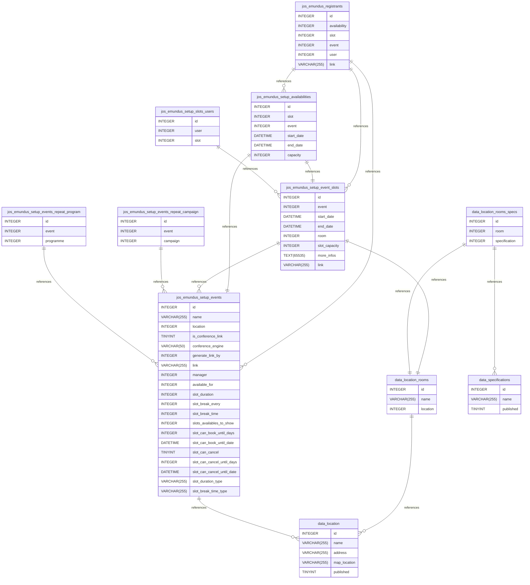

::: details Summary

- [Introduction](#introduction)
- [Database Type](#database-type)
- [Table Structure](#table-structure)
	- [jos_emundus_setup_events](#jos_emundus_setup_events)
	- [data_location](#data_location)
	- [data_location_rooms](#data_location_rooms)
	- [jos_emundus_setup_events_repeat_program](#jos_emundus_setup_events_repeat_program)
	- [jos_emundus_setup_events_repeat_campaign](#jos_emundus_setup_events_repeat_campaign)
	- [data_location_rooms_specs](#data_location_rooms_specs)
	- [data_specifications](#data_specifications)
	- [jos_emundus_setup_event_slots](#jos_emundus_setup_event_slots)
	- [jos_emundus_setup_slots_users](#jos_emundus_setup_slots_users)
	- [jos_emundus_setup_availabilities](#jos_emundus_setup_availabilities)
	- [jos_emundus_registrants](#jos_emundus_registrants)
- [Relationships](#relationships)
- [Database Diagram](#database-Diagram)

:::

## Database type

- **Database system:** MySQL
## Table structure

### jos_emundus_setup_events

| Name        | Type          | Settings                      | References                    | Note                           |
|-------------|---------------|-------------------------------|-------------------------------|--------------------------------|
| **id** | INTEGER | 🔑 PK, not null , unique, autoincrement |  | |
| **name** | VARCHAR(255) | not null  |  | |
| **location** | INTEGER | not null  | jos_emundus_setup_events_location_fk | |
| **is_conference_link** | TINYINT | not null , default: 0 |  | |
| **conference_engine** | VARCHAR(50) | not null  |  |teams, zoom, other |
| **generate_link_by** | INTEGER | not null  |  |Par réservation, par plage de réservation |
| **link** | VARCHAR(255) | not null  |  | |
| **manager** | INTEGER | not null  |  | |
| **available_for** | INTEGER | not null  |  |campaigns, programs |
| **slot_duration** | INTEGER | not null  |  | |
| **slot_break_every** | INTEGER | not null  |  | |
| **slot_break_time** | INTEGER | not null  |  | |
| **slots_availables_to_show** | INTEGER | not null  |  | |
| **slot_can_book_until_days** | INTEGER | not null  |  | |
| **slot_can_book_until_date** | DATETIME | not null  |  | |
| **slot_can_cancel** | TINYINT | not null  |  | |
| **slot_can_cancel_until_days** | INTEGER | not null  |  | |
| **slot_can_cancel_until_date** | DATETIME | not null  |  | |
| **slot_duration_type** | VARCHAR(255) | not null  |  | |
| **slot_break_time_type** | VARCHAR(255) | not null  |  | | 

### data_location

| Name        | Type          | Settings                      | References                    | Note                           |
|-------------|---------------|-------------------------------|-------------------------------|--------------------------------|
| **id** | INTEGER | 🔑 PK, not null , unique, autoincrement |  | |
| **name** | VARCHAR(255) | not null  |  | |
| **address** | VARCHAR(255) | not null  |  | |
| **map_location** | VARCHAR(255) | not null  |  | |
| **published** | TINYINT | not null , default: 1 |  | | 

### data_location_rooms

| Name        | Type          | Settings                      | References                    | Note                           |
|-------------|---------------|-------------------------------|-------------------------------|--------------------------------|
| **id** | INTEGER | 🔑 PK, not null , unique, autoincrement |  | |
| **name** | VARCHAR(255) | not null  |  | |
| **location** | INTEGER | not null  | data_location_rooms_location_id_fk | | 

### jos_emundus_setup_events_repeat_program

| Name        | Type          | Settings                      | References                    | Note                           |
|-------------|---------------|-------------------------------|-------------------------------|--------------------------------|
| **id** | INTEGER | 🔑 PK, not null , unique, autoincrement |  | |
| **event** | INTEGER | not null  | jos_emundus_setup_events_repeat_programme_event_id_fk | |
| **programme** | INTEGER | not null  |  | | 

### jos_emundus_setup_events_repeat_campaign

| Name        | Type          | Settings                      | References                    | Note                           |
|-------------|---------------|-------------------------------|-------------------------------|--------------------------------|
| **id** | INTEGER | 🔑 PK, not null , unique, autoincrement |  | |
| **event** | INTEGER | not null  | jos_emundus_setup_events_repeat_campaign_event_id_fk | |
| **campaign** | INTEGER | not null  |  | | 

### data_location_rooms_specs

| Name        | Type          | Settings                      | References                    | Note                           |
|-------------|---------------|-------------------------------|-------------------------------|--------------------------------|
| **id** | INTEGER | 🔑 PK, not null , unique, autoincrement |  | |
| **room** | INTEGER | not null  | data_location_rooms_specifications_room_id_fk | |
| **specification** | INTEGER | not null  | data_location_rooms_specifications_specification_id_fk | | 

### data_specifications

| Name        | Type          | Settings                      | References                    | Note                           |
|-------------|---------------|-------------------------------|-------------------------------|--------------------------------|
| **id** | INTEGER | 🔑 PK, not null , unique, autoincrement |  | |
| **name** | VARCHAR(255) | not null  |  | |
| **published** | TINYINT | not null , default: 1 |  | | 

### jos_emundus_setup_event_slots

| Name        | Type          | Settings                      | References                    | Note                           |
|-------------|---------------|-------------------------------|-------------------------------|--------------------------------|
| **id** | INTEGER | 🔑 PK, not null , unique, autoincrement |  | |
| **event** | INTEGER | not null  | jos_emundus_setup_ranges_event_id_fk | |
| **start_date** | DATETIME | not null  |  | |
| **end_date** | DATETIME | not null  |  | |
| **room** | INTEGER | not null  | jos_emundus_setup_ranges_room_id_fk | |
| **slot_capacity** | INTEGER | not null  |  | |
| **more_infos** | TEXT(65535) | not null  |  | |
| **link** | VARCHAR(255) | not null  |  | | 

### jos_emundus_setup_slots_users

| Name        | Type          | Settings                      | References                    | Note                           |
|-------------|---------------|-------------------------------|-------------------------------|--------------------------------|
| **id** | INTEGER | 🔑 PK, not null , unique, autoincrement |  | |
| **user** | INTEGER | not null  |  | |
| **slot** | INTEGER | not null  | jos_emundus_setup_ranges_users_range_id_fk | | 

### jos_emundus_setup_availabilities

| Name        | Type          | Settings                      | References                    | Note                           |
|-------------|---------------|-------------------------------|-------------------------------|--------------------------------|
| **id** | INTEGER | 🔑 PK, not null , unique, autoincrement | jos_emundus_setup_availabilities_id_fk | |
| **slot** | INTEGER | not null  |  | |
| **event** | INTEGER | not null  | jos_emundus_setup_availabilities_event_id_fk | |
| **start_date** | DATETIME | not null  |  | |
| **end_date** | DATETIME | not null  |  | |
| **capacity** | INTEGER | not null , default: 1 |  | | 

### jos_emundus_registrants

| Name        | Type          | Settings                      | References                    | Note                           |
|-------------|---------------|-------------------------------|-------------------------------|--------------------------------|
| **id** | INTEGER | 🔑 PK, not null , unique, autoincrement |  | |
| **availability** | INTEGER | not null  | jos_emundus_registrants_availability_fk | |
| **slot** | INTEGER | not null  | jos_emundus_registrants_slot_fk | |
| **event** | INTEGER | not null  | jos_emundus_registrants_event_fk | |
| **user** | INTEGER | not null  |  | |
| **link** | VARCHAR(255) | not null  |  | | 

## Relationships

- **jos_emundus_setup_events to data_location**: many_to_one
- **data_location_rooms to data_location**: many_to_one
- **jos_emundus_setup_events_repeat_program to jos_emundus_setup_events**: many_to_one
- **jos_emundus_setup_events_repeat_campaign to jos_emundus_setup_events**: many_to_one
- **data_location_rooms_specs to data_location_rooms**: one_to_one
- **data_location_rooms_specs to data_specifications**: many_to_one
- **jos_emundus_setup_event_slots to jos_emundus_setup_events**: many_to_one
- **jos_emundus_setup_event_slots to data_location_rooms**: one_to_one
- **jos_emundus_setup_slots_users to jos_emundus_setup_event_slots**: many_to_one
- **jos_emundus_setup_availabilities to jos_emundus_setup_event_slots**: one_to_one
- **jos_emundus_setup_availabilities to jos_emundus_setup_events**: one_to_one
- **jos_emundus_registrants to jos_emundus_setup_availabilities**: many_to_one
- **jos_emundus_registrants to jos_emundus_setup_event_slots**: many_to_one
- **jos_emundus_registrants to jos_emundus_setup_events**: many_to_one

## Database Diagram

