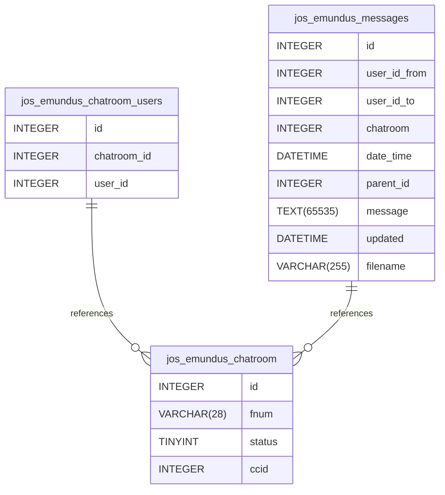

::: details Summary

- [Introduction](#introduction)
- [Database Type](#database-type)
- [Table Structure](#table-structure)
	- [jos_emundus_chatroom](#jos_emundus_chatroom)
	- [jos_emundus_chatroom_users](#jos_emundus_chatroom_users)
	- [jos_emundus_messages](#jos_emundus_messages)
- [Relationships](#relationships)
- [Database Diagram](#database-Diagram)

:::

## Database type

- **Database system:** MySQL
## Table structure

### jos_emundus_chatroom

| Name        | Type          | Settings                      | References                    | Note                          |
|-------------|---------------|-------------------------------|-------------------------------|-------------------------------|
| **id** | INTEGER | 🔑 PK, not null , unique, autoincrement |  |                               |
| **fnum** | VARCHAR(28) | not null  |  |                               |
| **status** | TINYINT | not null , default: 1 |  | If status = 0 chatroom closed |
| **ccid** | INTEGER | not null  |  |                               | 

### jos_emundus_chatroom_users

| Name        | Type          | Settings                      | References                    | Note                           |
|-------------|---------------|-------------------------------|-------------------------------|--------------------------------|
| **id** | INTEGER | 🔑 PK, not null , unique, autoincrement |  | |
| **chatroom_id** | INTEGER | not null  | jos_emundus_chatroom_users_chatroom_id_fk | |
| **user_id** | INTEGER | not null  |  | | 

### jos_emundus_messages

| Name        | Type          | Settings      | References                    | Note                           |
|-------------|---------------|---------------|-------------------------------|--------------------------------|
| **id** | INTEGER | 🔑 PK, not null , unique, autoincrement |  | |
| **user_id_from** | INTEGER | not null |  | |
| **user_id_to** | INTEGER | null |  | |
| **chatroom** | INTEGER | not null | jos_emundus_messages_chatroom_fk | |
| **date_time** | DATETIME | not null |  | |
| **parent_id** | INTEGER | not null , default: 0 |  | |
| **message** | TEXT(65535) | null |  | |
| **updated** | DATETIME | null |  | |
| **filename** | VARCHAR(255) | null |  | | 

## Relationships

- **jos_emundus_chatroom_users to jos_emundus_chatroom**: many_to_one
- **jos_emundus_messages to jos_emundus_chatroom**: many_to_one

## Database Diagram

