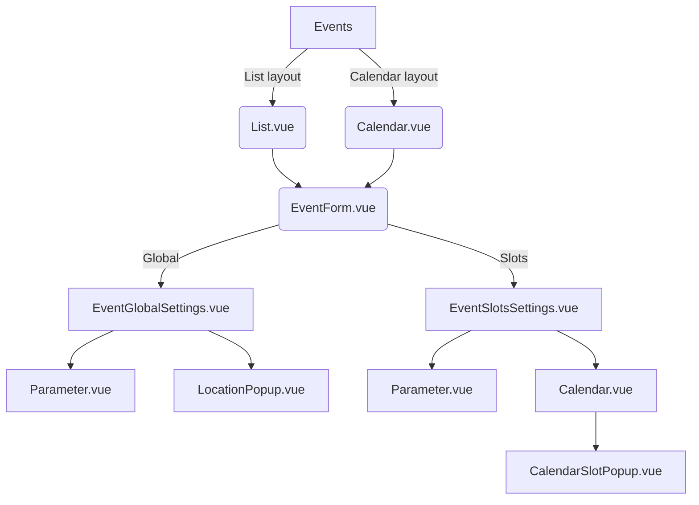

```mermaid
flowchart TD
A[Events] -->|List layout| B(List.vue)
A[Events] -->|Calendar layout| C(Calendar.vue)
B --> D(EventForm.vue)
C --> D(EventForm.vue)
D -->|Global| E[EventGlobalSettings.vue]
D -->|Slots| F[EventSlotsSettings.vue]
E --> G[Parameter.vue]
E --> H[LocationPopup.vue]
F --> I[Parameter.vue]
F --> J[Calendar.vue]
J --> K[CalendarSlotPopup.vue]
```